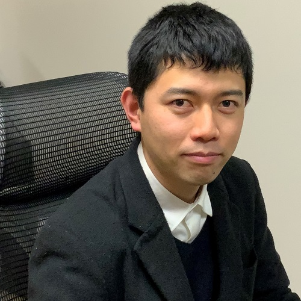

<!DOCTYPE html>
<html>
  <head>
    <meta charset="utf-8" />

    <meta name="viewport" content="width=device-width, initial-scale=1.0" />
    <title>Kazumasa Shimari</title>
    <!-- <link href="./bootstrap/css/bootstrap.css" rel="stylesheet" type="text/css" />
  <link href="./custom.css" rel="stylesheet" type="text/css" /> -->
  </head>

  <body>
    
<a href="./index.html">Japanese page</a>

    

      

        <h3>Kazumasa Shimari</h3>
        Associate Professor, Software Engineering Laboratory, Division of
        Information Science, Graduate School of Science and Technology, Nara
        Institute of Science and Technology
      

      
      
E-mail: k.shimari@is.(+naist.jp)

    

    

      <h2>Journal Papers</h2>
      <ul>
        <li>
          <b><u>Kazumasa Shimari</u></b
          >, Takashi Ishio, Tetsuya Kanda, Naoto Ishida, Katsuro Inoue, "NOD4J:
          Near-Omniscient Debugging Tool for Java Using Size-Limited Execution
          Trace," Science of Computer Programming, vol.206, pp102630, June 2021
          [<a
            href="https://sel.ist.osaka-u.ac.jp/lab-db/betuzuri/contents.ja/1199.html"
            >detail</a
          >]
        </li>
      </ul>
    

    

      <h2>Journal Papers (in Japanese)</h2>
      <ul>
        <li>
          <b><u>Kazumasa Shimari</u></b
          >, Takashi Ishio, Katsuro Inoue, "A clustering-based filtering method
          for similar source code fragment search," IEICE TRANSACTIONS on
          Information and Systems, Vol.J103-D, No.10, pp.751-753, October 2020
        </li>
        <li>
          <b><u>Kazumasa Shimari</u></b
          >, Takashi Ishio, Katsuro Inoue, "An execution trace recording method
          using a limited size storage for Java," Computer Software, Vol.36,
          No.4, pp.107-113, October 2019
        </li>
      </ul>
    

    

      <h2>Conference and Workshop Papers</h2>
      <ul>
        <li>
          Tetsuya Kanda, <b><u>Kazumasa Shimari</u></b
          >, Katsuro Inoue: "didiffff: A Viewer for Comparing Changes in both
          Code and Execution Trace," Proceedings of the 30th IEEE International
          Conference on Program Coprehension (ICPC 2022), Online, May 2022
        </li>
        <li>
          Sakutaro Sugiyama, Takashi Kobayashi, <b><u>Kazumasa Shimari</u></b
          >, Takashi Ishio, "JISDLab: A web-based interactive literate debugging
          environment," Proceedings of the 29th IEEE International Conference
          onSoftware Analysis, Evolution and Reengineering (SANER 2022), Online,
          March 2022
        </li>
        <li>
          <b><u>Kazumasa Shimari</u></b
          >, Takashi Ishio, Tetsuya Kanda, Katsuro Inoue: "Near-Omniscient
          Debugging for Java Using Size-Limited Execution Trace," Proceedings of
          the 35th IEEE International Conference on Software Maintenance and
          Evolution (ICSME 2019), pp.398-401, Cleveland, OH, USA, October 2019
          [<a
            href="https://sel.ist.osaka-u.ac.jp/lab-db/betuzuri/contents.ja/1172.html"
            >detail</a
          >]
        </li>
        <li>
          Tsuyoshi Mizouchi, <b><u>Kazumasa Shimari</u></b
          >, Takashi Ishio, Katsuro Inoue: "PADLA: A Dynamic Log Level Adapter
          Using Online Phase Detection," Proceedings of the IEEE/ACM 27th
          International Conference on Program Comprehension (ICPC 2019),
          pp.135-138, Montreal, Quebec, Canada, May 2019 [<a
            href="https://sel.ist.osaka-u.ac.jp/lab-db/betuzuri/contents.ja/1157.html"
            >detail</a
          >]
        </li>
      </ul>
    

    

      <h2>Award</h2>
      <ul>
        <li>
          <b><u>Kazumasa Shimari</u></b
          >, "Repayment Exemption of Student Loan for Students with Excellent
          Grades", Japan Student Services Organization (JASSO) Type I
          (interest-free) scholarship", May 2019
        </li>
        <li>
          <b><u>Kazumasa Shimari</u></b
          >, "The Live Paper and Poster Award", JSSST FOSE2018 , November 2018
        </li>
        <li>
          Tsuyoshi Mizouchi, <b><u>Kazumasa Shimari</u></b
          >, Takashi Ishio, Tetsuya Kanda, Katsuro Inoue, "The Interactive
          Award", IPSJ/SIGSE Software Engineering Symphosium, September 2018
        </li>
        <li>
          <b><u>Kazumasa Shimari</u></b
          >, "The Enouragement Award of Student Presentation", IPSJ/SIGSE
          Software Engineering Symphosium, September 2017
        </li>
      </ul>
    

    

      <h2>Thesis</h2>
      <ul>
        <li>
          Ph.D. Thesis: "Study on Cost-Effective Debugging Methods under
          Restricted Resources" (2022.03) [<a
            href="https://sel.ist.osaka-u.ac.jp/lab-db/Dthesis/contents.ja/41.html"
            >detail</a
          >]
        </li>
        <li>
          Master Thesis: "The proposal and evaluation of an execution trace
          recording method using a limited size storage for Java.", February
          2019 (in Japanese)[<a
            href="https://sel.ist.osaka-u.ac.jp/lab-db/Mthesis/contents.en/144.html"
            >detail</a
          >]
        </li>
        <li>
          Bachelor Thesis: "Developing the prototype of a low invasive execution
          monitoring tool for software failure analysis", February 2017 (in
          Japanese)[<a
            href="https://sel.ist.osaka-u.ac.jp/lab-db/Bthesis/contents.en/155.html"
            >detail</a
          >]
        </li>
      </ul>
    

    

      <h2>Academic Service</h2>
      <ul>
        <li>2018.12: APSEC2018 Student Volunteer</li>
      </ul>
    

    

      <h2>Education</h2>
      <ul>
        <li>
          2022.04-: Assistant Professor, Software Engineering Laboratory,
          Division of Information Science, Graduate School of Science and
          Technology, Nara Institute of Science and Technology
        </li>

        <li>
          2019.04-2022.03: Doctor of Information Science and Technology,
          Graduate School of Information Science and Technology, Osaka
          University.
        </li>
        <li>
          2017.04-2019.03: Master of Information Science and Technology,
          Graduate School of Information Science and Technology, Osaka
          University.
        </li>
        <li>
          2013.04-2017.03: Bachelor of Information and Computer Sciences School
          of Engineering Science, Osaka University
        </li>
      </ul>
    

    

      <h2>TA・RA</h2>
      <ul>
        <li>2021.07-2022.03: Student Researcher (IST, Osaka Univ.)</li>
        <li>
          2019.07-2021.06: Specially Appointed Researcher (OTRI, Osaka Univ.)
        </li>
        <li>2019.04-2019.06: Research Assistant (IST, Osaka Univ.)</li>
        <li>2018.06-2018.09: Cloud Spiral (IST, Osaka Univ.)</li>
        <li>2017.10-2018.02: Computer Language Processing (ES, Osaka Univ.)</li>
      </ul>
    

    

      <h2>Special Program</h2>
      <ul>
        <li>
          2017:Cloud Spiral Cloud Specialist Program Initiative for
          Reality-based Advanced Learning(Cloud Spiral)
        </li>
      </ul>
    

    

      <h2>OSS</h2>
      <ul>
        <li>
          <a href="https://github.com/k-shimari/nod4j">NOD4J</a>: Tool for
          recording and visualizing the values of variable in execution
          near-omnisciently
        </li>
      </ul>
    

  </body>
</html>
